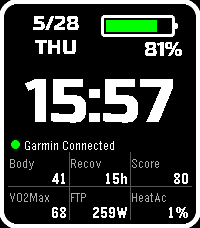

# Garmin Fitness Face

A Pebble watchface for Pebble Time 2 that displays fitness data fetched from Garmin Connect.



## Features

- Large time display with Russo One font
- Date and day of week
- Pebble battery bar with percentage
- Garmin Connect connection status indicator
- Color themes: Graphite, Blueberry, Grape, Tangerine, Lime, and Strawberry, with a Reverse option
- 3 configurable top slots for Pebble native metrics (date, battery, heart rate, steps, sleep, weather, etc.)
- 4 configurable bottom slots for Garmin Connect metrics

## Available Metrics

| Key | Metric |
|-----|--------|
| BB | Body Battery |
| STR | Stress |
| HR | Heart Rate |
| STP | Steps |
| O2 | Blood Oxygen (SpO2) |
| RSP | Respiration Rate |
| SLP | Sleep Score |
| SCH | Sleep Coach |
| HRV | HRV Status |
| REC | Recovery Time |
| TRD | Training Readiness |
| VO2 | VO2 Max |
| FTP | Cycling FTP |
| MIN | Weekly Intensity Minutes |
| TLD | Training Load |
| TST | Training Status |
| HEA | Heat Acclimation |
| ALT | Altitude Acclimation |

## Requirements

- Pebble Time 2
- [Rebble](https://rebble.io/) account (for app store / phone app)
- Garmin Connect account
- Garmin device synced to Garmin Connect

> [!WARNING]
> Garmin credentials (username and password) are stored in **plain text** by the Pebble Clay configuration system. There is no secure storage available in the Pebble SDK.
>
> - **Disable 2FA** on your Garmin account before use
> - Use a **dedicated password** — do not reuse your main Garmin password
> - Do not use this on shared or untrusted devices

## Setup

1. Install the watchface via the Pebble app
2. Open the watchface settings
3. Enter your Garmin Connect username and password
4. Select a color theme and optionally enable Reverse
5. Select the metrics to display in the data slots
6. Set the refresh interval (10–50 minutes)
7. Save — data will sync immediately

## Building

Requires the [Pebble SDK](https://developer.rebble.io/developer.pebble.com/sdk/index.html).

```sh
npm install
pebble build
```

To install on a connected Pebble:

```sh
pebble install --phone <phone-ip>
```

## Layout

```
┌──────────────────────────────────────┐
│  [5/27  WED]    [████░░ 88%]         │  date / battery
│  [         7:17             ]        │  time
│  [● Garmin Connected        ]        │  connection status
│  [BB  87│STR  42│HR   68   ]        │
│  [STP  8K│SLP  78│HRV  Bal ]        │  6 data slots
└──────────────────────────────────────┘
```

## License

MIT
